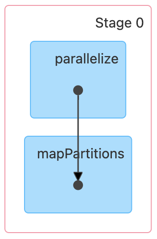
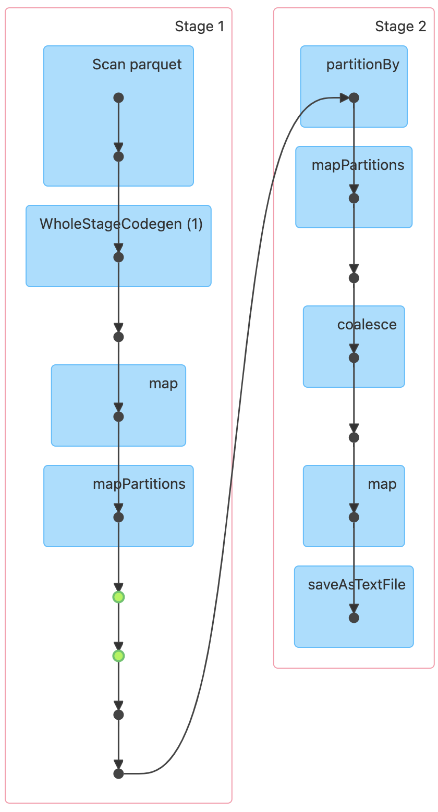

# W5M1 - Data Analysis using RDD

## 프로젝트 개요
Apache Spark의 RDD API를 사용하여 NYC 택시 데이터셋을 분석하는 프로젝트이다. 주요 목표는 Spark의 내부 동작(RDD, DAG, Lazy Evaluation)에 대한 이해를 높이는 것이다.

## 환경 설정
### Spark 및 Hadoop 설정
- Spark Standalone 클러스터 사용
- HDFS를 데이터 저장소로 활용
- Spark History Server 활성화하여 실행 기록(DAG 등) 분석 가능

### 사용한 데이터 - NYC Yellow Taxi 데이터
- **출처:** NYC Taxi & Limousine Commission [(TLC)](https://www.nyc.gov/site/tlc/about/tlc-trip-record-data.page)
- **설명:** 뉴욕시 5개 자치구(Manhattan, Brooklyn, Queens, Bronx, Staten Island)에서 운행된 Yellow Taxi의 이동 데이터를 포함함.
- **사용한 데이터 범위:** 2021년 1월 ~ 12월
- **주요 컬럼:**
  - `tpep_pickup_datetime`: 택시 승차(픽업) 시간
  - `pickup_hour`: 픽업 시간 (시간 단위 추출)
  - `trip_distance`: 이동 거리 (마일)
  - `trip_duration_min`: 이동 시간 (분 단위)
  - `total_amount`: 승객이 지불한 총 금액 (요금 + 팁 + 기타 비용)

## 데이터 처리 과정

### SparkSession 및 SparkContext 생성
쓰임이 없어보이는 SparkContext 명시적으로 가져오는 이유 - RDD API를 직접 수행하기 위해 
```python
from pyspark import SparkContext
from pyspark.sql import SparkSession
from datetime import datetime

spark = SparkSession.builder.appName("NYC_Taxi_RDD_Analysis").getOrCreate()
sc = spark.sparkContext
```

### HDFS에서 데이터 로드 후 RDD 변환
RDD 변환 시 각 데이터 행을 튜플 형태로 유지하면...
- 키-값 기반 연산 가능
- 데이터 구조를 명확하게 유지
- RDD API만 사용해야 하는 경우, 스키마가 불분명하거나 동적으로 변할 가능성 있는 경우 유리
- 변환 과정에서 불필요한 연산이 증가한다는 단점
```python
data_path = "hdfs://hadoop-namenode:9000/user/root/dataset/"
df = spark.read.parquet(data_path)
raw_rdd = df.rdd  # RDD 변환, 튜플 유지
```

### 1. 데이터 필터링: 누락된 값/ 잘못된 값 제거 (Stage 0)
```python
filtered_rdd = raw_rdd.filter(lambda row: (
    row.tpep_pickup_datetime is not None and 
    row.trip_distance is not None and    
    row.fare_amount is not None and
    row.trip_distance > 0 and 
    row.fare_amount > 0 and
    row.tpep_pickup_datetime.year == 2021
)).cache()
```

### 2. 데이터 파싱: (날짜, (거리, 요금, 1)) 형태로 변환
```python
def parse_row(row):
    try:
        date = row.tpep_pickup_datetime.date().isoformat()
        return (date, (row.trip_distance, row.fare_amount, 1))  # (날짜, (총 거리, 총 요금, 트립 수))
    except:
        return None
```

### 3. 변환 및 필터링(캐싱 적용) (Stage 1)
```python
parsed_rdd = filtered_rdd.map(parse_row).filter(lambda x: x is not None).cache()
```

### 4. 집계 연산: 날짜별 총 이동 거리, 총 수익, 총 택시 이용 횟수 계산 (Stage 2)
```python
daily_metrics_rdd = parsed_rdd.reduceByKey(lambda a, b: (
    a[0] + b[0],  # 총 이동 거리
    a[1] + b[1],  # 총 수익
    a[2] + b[2]   # 총 택시 이용 횟수
)).mapValues(lambda v: (v[2], v[1], v[0] / v[2], v[1] / v[2]))  # 바로 평균 계산
```

### 5. 저장 전에 파티션 조정하여 셔플 최소화
```python
final_rdd = daily_metrics_rdd.coalesce(1)  # 스테이지 줄이기 위한 최적화
```

### 6. 결과 저장 (HDFS)
```python
output_path = "hdfs://hadoop-namenode:9000/user/root/outputs/taxi_rdd_results"
sorted_rdd.saveAsTextFile(output_path)
```
### 7. 불필요한 캐시 해제
```python
filtered_rdd.unpersist()
daily_metrics_rdd.unpersist()
```

### 8. SparkContext 종료
```python
sc.stop()
```

## 트러블슈팅
### 1. Spark History Server 설정 오류
- `/usr/local/spark/conf/spark-defaults.conf` 파일이 컨테이너 재시작 시 초기화되는 문제 발생
- 해결: `Dockerfile`에서 로컬에 설정 파일을 유지한 후 컨테이너 시작 시 복사하도록 수정

### 2. HDFS Safe Mode로 인해 데이터 삭제 불가
- `rm: Cannot delete /user/root/outputs/taxi_rdd_results. Name node is in safe mode.`
- 해결: `hdfs dfsadmin -safemode leave` 명령어 실행 후 삭제 시도

### 3. 이벤트 로그 분석 시 UnknownHostException 발생
- `hadoop-namenode`의 호스트를 찾지 못하는 문제 발생
- 해결: `spark-defaults.conf`에 올바른 `spark.history.fs.logDirectory` 설정
---
## 코드 내 연산들(Transformation + Actions)
| 연산 종류 | 사용한 연산 | 설명 |  
|-----------|----------------|----------------------------------------------|  
| **필터링** | `filter()` | 2021년 데이터만 남기고, 거리/요금이 0 이하인 데이터 제거 |  
| **매핑** | `map()` | (날짜, (거리, 요금, 1)) 형태로 변환 |  
| **변환 후 필터링** | `filter()` | 변환 실패한 데이터(None) 제거 |  
| **집계** | `reduceByKey()` | 날짜별 총 거리, 총 요금, 총 트립 수 계산 |  
| **값 변환** | `mapValues()` | 총 트립 수, 총 요금, 평균 거리, 평균 요금 계산 |  
| **파티션 최적화** | `coalesce(1)` | 저장 시 셔플 최소화를 위해 파티션 수 줄이기 |  
| **결과 저장** | `saveAsTextFile()` | 최종 분석 결과를 HDFS에 저장 |  

총  **6개의 변환 (Transformations) + 1개의 액션 (Action)** 이 포함

---
## DAG 분석 및 스테이지 개수
이 코드의 실행 과정에서 총 **3개**의 스테이지가 생성됨

### 1. stage0
데이터 로드 후 필터링 및 변환 수행 (raw_rdd -> filtered_rdd)

### 2. stage1
Parquet 데이터 읽기 & 파싱 (filtered_rdd.map(parse_row).cache())

### 3. stage2
reduceByKey()로 집계 후 coalesce(1) 적용하여 저장 최적화 → .saveAsTextFile()


 | 
---|---|


## 실행 방법
```sh
/usr/local/bin/submit-taxi-analysis.sh
```

## 최적화된 점
- 스테이지 개수를 최대한 감소
- reduceByKey() 후 mapValues()로 평균값 즉시 계산 (불필요한 map 제거)
- coalesce(1) 적용하여 저장 시 셔플 최소화
- 필터링 + 캐싱을 적절히 활용하여 연산 비용 절감

