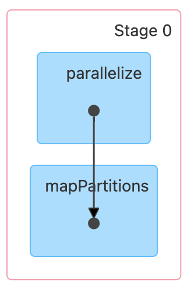
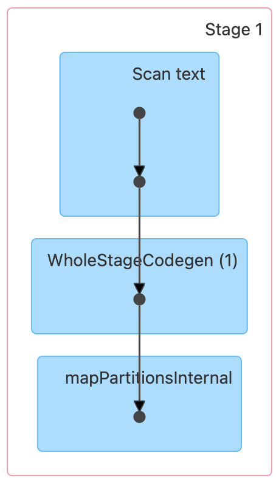
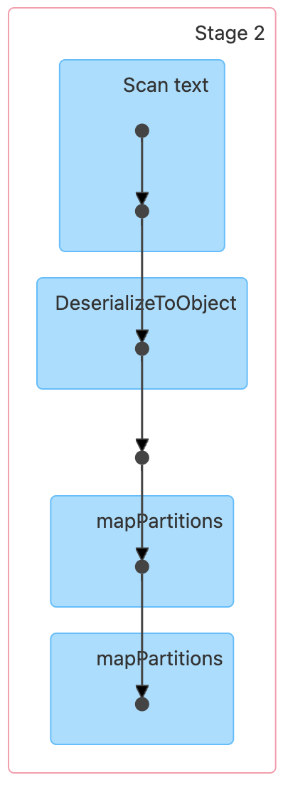
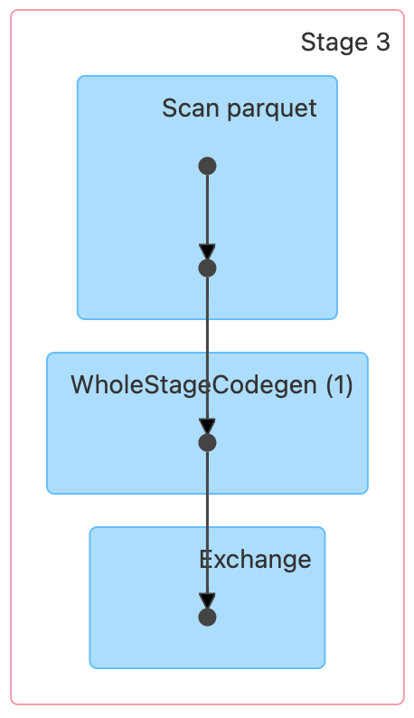
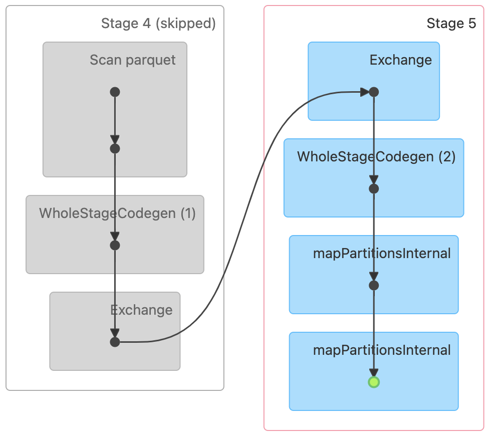
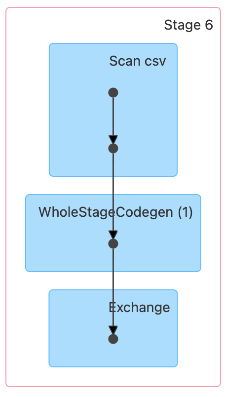
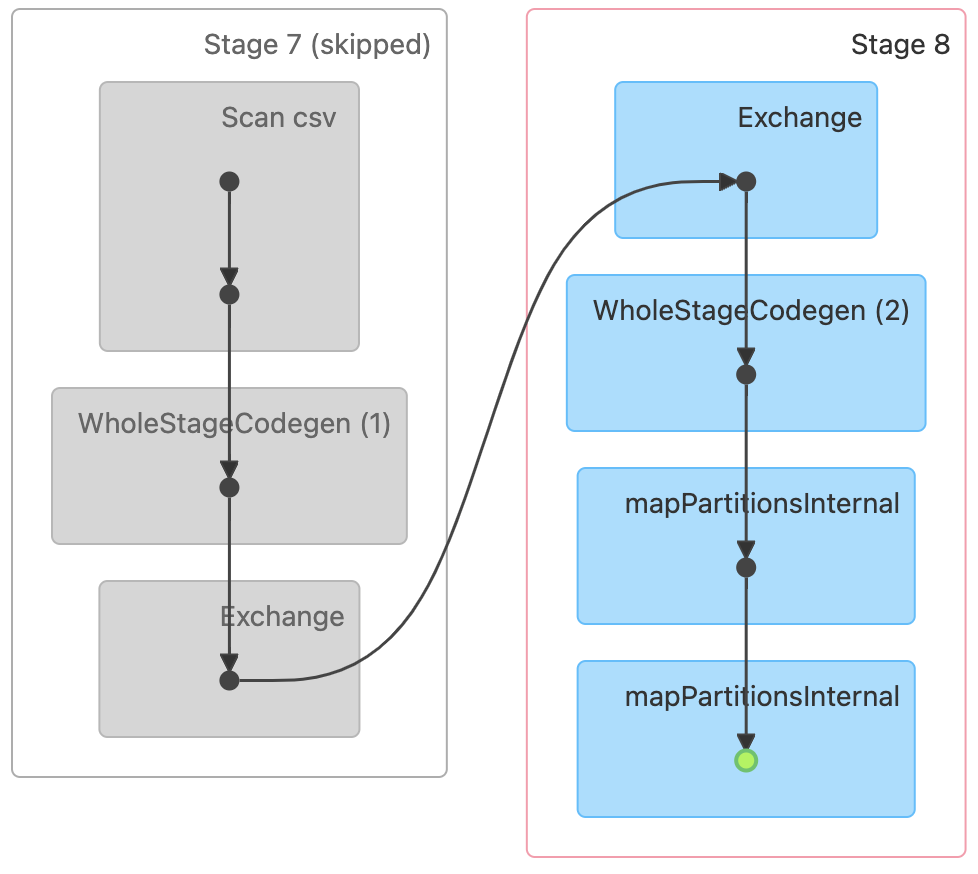
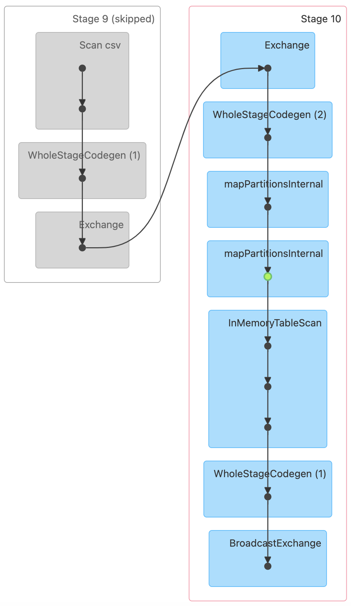
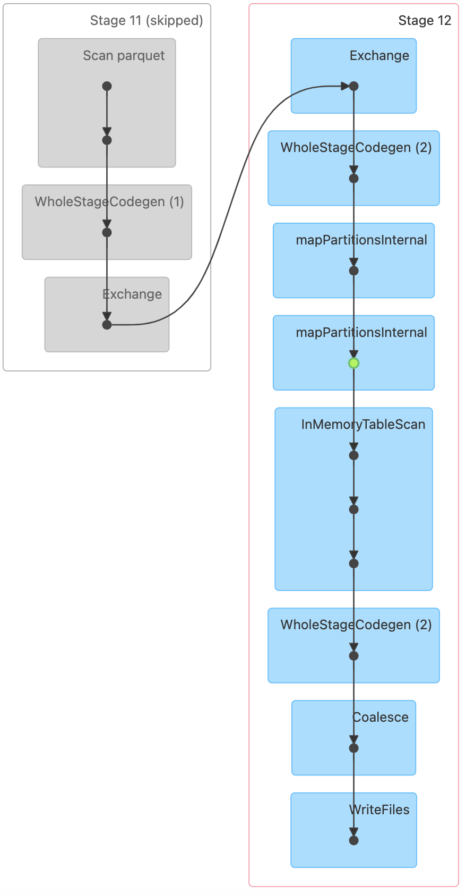

# W5M2 - Data Analysis using DataFrame

## 프로젝트 개요
Apache Spark의 DataFrame을 사용하여 NYC 택시 데이터셋을 분석하는 프로젝트이다. 주요 목표는 Spark의 내부 동작(DataFrame 및 DAG)에 대한 이해를 높이는 것이다.

## 환경 설정
### Spark 및 Hadoop 설정
- Spark Standalone 클러스터 사용
- HDFS를 데이터 저장소로 활용
- Spark History Server 활성화하여 실행 기록(DAG 등) 분석 가능

### 사용한 데이터 - NYC Yellow Taxi 데이터
- **출처:** NYC Taxi & Limousine Commission [(TLC)](https://www.nyc.gov/site/tlc/about/tlc-trip-record-data.page)
- **설명:** 뉴욕시 5개 자치구(Manhattan, Brooklyn, Queens, Bronx, Staten Island)에서 운행된 Yellow Taxi의 이동 데이터를 포함함.
- **사용한 데이터 범위:** 2021년 1월 ~ 12월
- **주요 컬럼:**
  - `tpep_pickup_datetime`: 택시 승차(픽업) 시간
  - `pickup_hour`: 픽업 시간 (시간 단위 추출)
  - `trip_distance`: 이동 거리 (마일)
  - `trip_duration_min`: 이동 시간 (분 단위)
  - `total_amount`: 승객이 지불한 총 금액 (요금 + 팁 + 기타 비용)

  ### 사용한 데이터 - NYC Hourly Climate 데이터
- **출처:** Kaggle (Albany, New York 기후 데이터) [(Kaggle)](https://www.kaggle.com/datasets/die9origephit/temperature-data-albany-new-york/data)
- **설명:** Albany(뉴욕의 도시) 기상 관측소에서 수집한 시간별 기후 데이터. 뉴욕시의 기후 트렌드를 대체적으로 반영할 수 있음.
- **사용한 데이터 범위:** 2021년 1월 ~ 12월
- **주요 컬럼:**
  - `DATE`: 관측 날짜
  - `weather_datetime`: 관측 시간 (UTC 기준)
  - `temperature`: 기온 (화씨)
  - `humidity`: 상대 습도 (%)
  - `precipitation`: 강수량 (인치)
  - `wind_speed`: 풍속 (mph)

## 데이터 처리 과정

### SparkSession 및 SparkContext 생성
쓰임이 없어보이는 SparkContext 명시적으로 가져오는 이유 - RDD API를 직접 수행하기 위해 
```python
from pyspark import SparkContext
from pyspark.sql import SparkSession
from datetime import datetime

spark = SparkSession.builder.appName("NYC_Taxi_DF_Analysis").getOrCreate()
sc = spark.sparkContext
```

### HDFS에서 데이터 로드(path 지정)
데이터프레임을 이용할 때의 장점
- Spark가 내부적으로 최적화하여 실행 속도 향상
- 불필요한 셔플 최소화
- SQL과 유사한 API로 간결하고 가독성 높은 코드
```python
taxi_data_path = "hdfs://hadoop-namenode:9000/user/root/dataset/"
weather_data_path = "hdfs://hadoop-namenode:9000/user/root/weather_data/"
```

### 1. 택시 데이터 로드
```python
taxi_df = spark.read.parquet(taxi_data_path)
```

### 2. 택시 데이터 변환(to_data) & 클리닝
```python
taxi_df = taxi_df.withColumn("pickup_date", to_date(col("tpep_pickup_datetime")))
taxi_df = taxi_df.filter(
    (col("tpep_pickup_datetime").isNotNull()) &
    (col("trip_distance").isNotNull()) &
    (col("fare_amount").isNotNull()) &
    (col("trip_distance") > 0) &
    (col("fare_amount") > 0) &
    (col("passenger_count") >= 2) &  # 승객이 2명 이상인 경우만 필터링
    (col("pickup_date") >= "2021-01-01") &
    (col("pickup_date") <= "2021-12-31")
)
```

### 3. 날씨 데이터 로드
```python
weather_df = spark.read.csv(weather_data_path, header=True, inferSchema=True)
```

### 4. 날씨 데이터 변환(to_date)
```python
weather_df = weather_df.withColumn("date_only", to_date(substring(col("DATE"), 1, 10)))
```

### 5. 날짜별 평균 기온, 평균 강수량, 평균 풍속 계산(캐싱 적용)
```python
weather_agg_df = weather_df.groupBy("date_only").agg(
    round(avg("HourlyDryBulbTemperature"), 2).alias("avg_temp"),
    round(avg("HourlyPrecipitation"), 2).alias("avg_precipitation"),
    round(avg("HourlyWindSpeed"), 2).alias("avg_wind_speed")
).cache()
```

### 6. 날짜별 택시 데이터 요약(캐싱 적용)
```python
daily_metrics_df = taxi_df.groupBy("pickup_date").agg(
    round(sum("trip_distance"), 2).alias("total_distance"),
    round(sum("fare_amount"), 2).alias("total_revenue"),
    round(avg("trip_distance"), 2).alias("avg_distance"),
    round(avg("fare_amount"), 2).alias("avg_fare")
).cache()
```

### 7. 택시 데이터와 날씨 데이터 조인(날짜 타입 일치)
```python
final_df = daily_metrics_df.join(
    weather_agg_df,
    daily_metrics_df.pickup_date == weather_agg_df.date_only,
    "left"
).drop("date_only")  # 중복 컬럼 제거
```

### 8. 결과 저장 (HDFS)
```python
output_path = "hdfs://hadoop-namenode:9000/user/root/outputs/taxi_df_results"
final_df.write.mode("overwrite").option("header", "true").csv(output_path)
```

### 9. 불필요한 캐시 해제(메모리 관리)
```python
weather_agg_df.unpersist()
daily_metrics_df.unpersist()
```

### 종료
```python
spark.stop()
```

---
## 코드 내 연산들(Transformation + Actions)
| 연산 종류 | 사용한 연산 | 설명 |  
|-----------|----------------|----------------------------------------------|  
| **데이터 로딩** | `spark.read.parquet()` | NYC 택시 데이터를 Parquet 포맷으로 로드 |  
|  | `spark.read.csv()` | 날씨 데이터를 CSV 포맷으로 로드 |  
| **필터링** | `filter()` | 2021년 데이터만 남기고, 거리/요금이 0 이하인 데이터 제거 |  
| **컬럼 변환** | `withColumn()` | `tpep_pickup_datetime`에서 `pickup_date`를 생성 |  
|  | `substring()` | `DATE` 컬럼에서 연-월-일 정보만 추출 |  
| **집계 (GroupBy + Agg)** | `groupBy().agg()` | 날짜별 총 이동 거리, 총 수익, 평균 요금, 평균 거리, 평균 기온, 평균 강수량, 평균 풍속 계산 |  
| **캐싱** | `cache()` | 반복 사용되는 DataFrame을 메모리에 캐싱하여 성능 최적화 |  
| **조인 (Join)** | `join()` | 날짜별 요약된 택시 데이터와 날씨 데이터를 날짜 기준으로 조인 |  
| **컬럼 삭제** | `drop()` | 조인 후 중복된 `date_only` 컬럼 제거 |  
| **결과 저장** | `write.csv()` | 최종 분석 결과를 HDFS에 CSV 포맷으로 저장 |  
| **캐싱 해제** | `unpersist()` | 사용이 끝난 캐싱된 DataFrame을 해제하여 메모리 최적화 |  

### **총 연산 개수**
- **변환(Transformations): 7개** (필터링, 컬럼 변환, 집계, 캐싱, 조인, 컬럼 삭제)
- **액션(Actions): 2개** (결과 저장, 캐싱 해제)  

➡ **RDD보다 최적화된 실행 속도와 직관적인 코드로, Spark DataFrame API의 장점을 활용한 코드**

---
## DAG 분석 및 스테이지 개수
이 코드의 실행 과정에서 총 **12개**의 스테이지가 생성됨

### stage0
내부적으로 Spark 작업 초기화




### stage1
weather_data.csv 스캔 및 변환




### stage2
csv 데이터를 Spark DataFrame으로 변환




### stage3
택시 데이터 로드 및 변환(필터링 및 날짜 컬럼 추가)




### stage 4
groupBy()를 이용해 택시 데이터 집계(날짜별 이동거리, 요금 계산 등)

### stage 5
groupBy()를 이용해 날씨 데이터 집계(평균 기온 강수량 등)




### stage 6
csv 데이터 로드 후 셔플




### stage 7
csv 데이터 로드 후 추가 변환

### stage 8
csv 데이터 조인 과정에서 발생한 셔플




### stage 9
join()을 수행하여 daily_metrics_df와 weather_agg_df 조인

### stage 10
Broadcast Join이 적용됨

Broadcast Join: 작은 데이터셋을 모든 Executor에 복사하여 큰 데이터와 빠르게 조인하는 방식




### stage 11
최종 데이터 저장




## 실행 방법
```sh
/usr/local/bin/submit-taxi-analysis.sh
```

## 최적화된 점
- 불필요한 데이터 로딩 방지: coalesce(1) 적용하여 단일 CSV 파일 저장
- 연산 성능 향상: groupBy() 연산 결과를 cache() 적용하여 반복 연산 방지
- DAG 최적화: 조인 이후 불필요한 컬럼 제거로 불필요한 셔플 방지
- 헤더 포함한 결과 저장: .option("header", "true") 적용하여 가독성 개선


